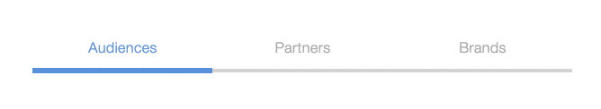

# React segtabs (segmented tab control)

An adaptable implementation of a Segmented Control interface in React JS.

By [Tom Barrasso](https://barrasso.me)

Accessibility (keyboard navigation)

Thank you!

### TODO

- [ ] Programmable color
- [ ] Allow multi selection?
- [ ] Ability to link tabs to panels (with aria-controls labels)
- [ ] Validate for 508 compliance
- [ ] Support icons with and without text
- [ ] Support right-to-left layouts/ languages
